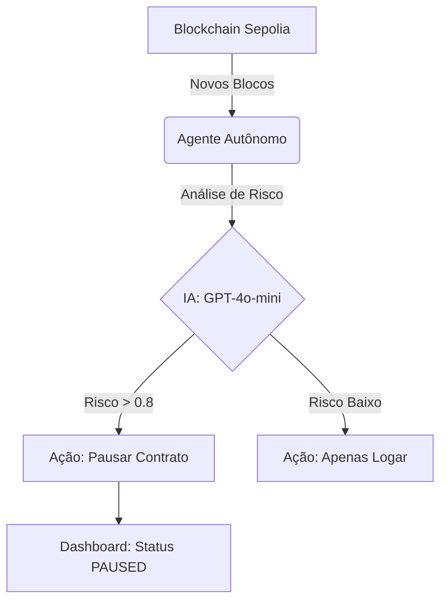
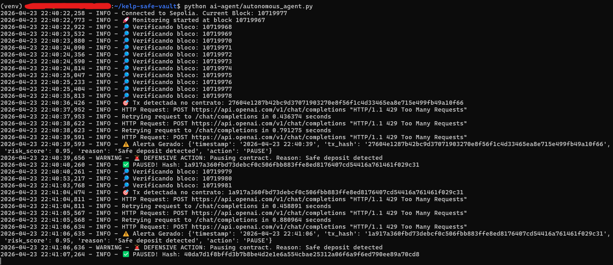
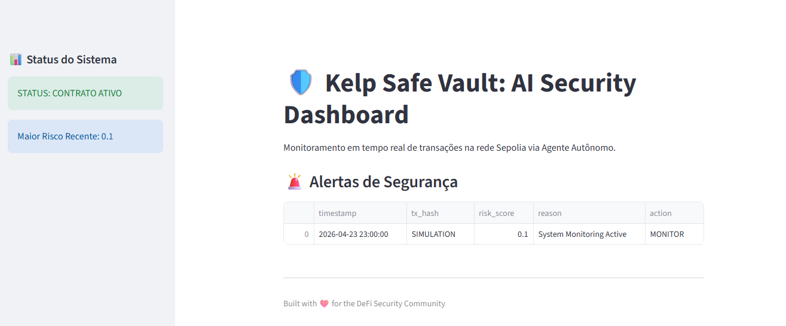

# Kelp Safe Vault: Autonomous AI Security Agent

> Smart Contract Security Lab: Um agente de IA autônomo que monitora transações em tempo real na rede Sepolia, detecta ameaças via LLM e executa pausas defensivas automaticamente.


## Visão Geral do Projeto

Este projeto demonstra um mecanismo de defesa proativo contra exploits de reentrada e drenagem de protocolos DeFi. Ele combina:
1.  **Smart Contract Seguro (`SafeVault`)**: Implementa padrões de segurança para prevenir ataques.
2.  **Agente de IA Autônomo**: Monitora a blockchain, analisa o risco via LLM (OpenAI) e pausa o contrato se detectar ameaças críticas.
3.  **Real-time Dashboard**: Interface Streamlit para visualização de alertas e status do contrato.

## Arquitetura do Sistema



## Demonstração de Resultados (Testes Reais)

O sistema foi testado com sucesso na rede **Sepolia**. Abaixo estão as evidências da detecção e resposta automática.

### Resposta do Agente no Terminal
O print abaixo comprova o momento em que o agente detectou uma transação suspeita, calculou o risco em **0.95** e executou o comando de pausa na blockchain.



*   **Log Principal:** `🚨 DEFENSIVE ACTION: Pausing contract.`
*   **Confirmação:** `✅ PAUSED! Hash: 0x1a917a360fbd73debcf0c506fbb883ffe8ed8176407cd54416a761461f029c31`

### Dashboard de Monitoramento
Interface visual que exibe os alertas gerados e o status atual do contrato.



---

## Tech Stack
*   **Blockchain:** Solidity, Foundry, Sepolia Testnet.
*   **Backend/AI:** Python 3.12, Web3.py, OpenAI API.
*   **Frontend:** Streamlit.
*   **Hospedagem:** Hugging Face Spaces.

## Como Rodar o Dashboard Localmente

Se você deseja rodar a interface em sua máquina:

1. Entre na pasta do dashboard:
   ```bash
   cd dashboard
   ```
2. Crie um ambiente virtual:
   ```bash
   python3 -m venv venv
   source venv/bin/activate
   ```
3. Instale as dependências e rode:
   ```bash
   pip install -r requirements.txt
   streamlit run app.py
   ```

## Links Úteis
*   **Live Dashboard:** [Hugging Face Space](https://huggingface.co)
*   **Smart Contract:** [Etherscan Sepolia](https://etherscan.io)

---
Construído para a comunidade de Segurança DeFi. 🚀

